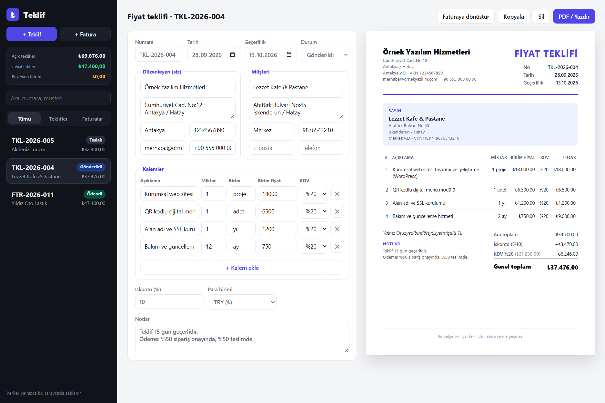
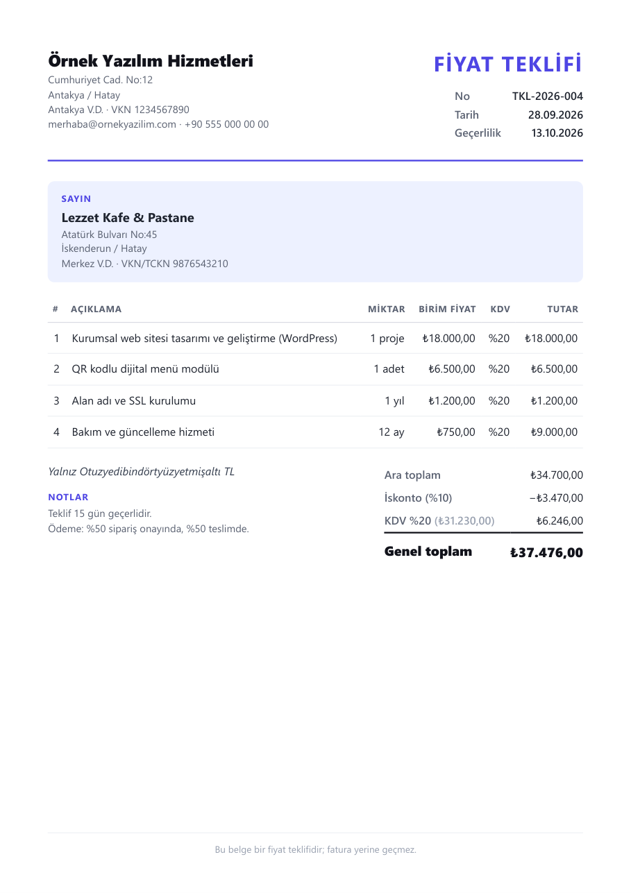

# Teklif — Teklif ve Fatura Oluşturucu

[](https://github.com/ilkertokat/teklif/actions)


**Freelancer'lar ve küçük işletmeler için tarayıcıda çalışan, sunucusuz bir teklif ve fatura oluşturucu.** Kalemleri girersiniz; KDV oranlarına göre ayrılmış toplamlar, iskonto ve "Yalnız … TL" satırı otomatik hesaplanır. Belge, yanında canlı bir A4 önizlemeyle güncellenir ve tek tıkla PDF olarak kaydedilir.

> *English summary below.*



## Neden?

Müşterilerime teklif hazırlarken her seferinde Word şablonunu kopyalayıp KDV'yi elle hesaplıyordum. Bu uygulama o işi bir dakikaya indiriyor: kurulum, hesap, sunucu yok; veriler yalnızca tarayıcıda kalıyor.

## Özellikler

- 🧾 **Teklif ve fatura** · yıla göre otomatik numaralandırma (`TKL-2026-004`, `FTR-2026-011`)
- 🧮 **Doğru hesap:** Tüm tutarlar kuruş cinsinden tam sayıyla hesaplanır (kayan nokta hatası yok); KDV oran bazında gruplanır (%20 / %10 / %1 / %0), iskonto KDV'den önce ve gruplara orantılı uygulanır
- ✍️ **Tutar yazıyla:** Türkçe fatura geleneğindeki "Yalnız Otuzyedibindörtyüzyetmişaltı TL" satırı (TRY, EUR, USD)
- 🔁 **Teklifi faturaya dönüştür:** Kabul edilen teklif tek tıkla faturaya döner, teklif "Kabul edildi" olarak işaretlenir
- 📄 **Canlı A4 önizleme ve PDF:** Yazdırma stili yalnızca belgeyi, birebir A4 ölçüsünde çıkarır
- 📊 **Özet:** Açık teklifler, tahsil edilen ve bekleyen faturalar
- 🔎 Arama, tür filtresi, durum etiketleri (Taslak / Gönderildi / Kabul / Ödendi), belge kopyalama
- 💾 Veriler `localStorage`'da; sunucu ya da hesap gerekmez · firma bilgileri bir kez girilir, sonraki belgelere otomatik gelir

### Örnek PDF çıktısı



## Çalıştırma

```bash
npm install
npm run dev        # http://localhost:5173
npm test           # Vitest — 22 test
npm run build      # dist/ — statik olarak her yerde yayınlanabilir
```

`main` dalına her gönderimde GitHub Actions testleri çalıştırır, derler ve **GitHub Pages**'e yayınlar.

## Mimari

```
src/
├── lib/
│   ├── types.ts     # Doc, LineItem, Party tipleri
│   ├── money.ts     # Kuruş tabanlı hesap, KDV gruplama, iskonto, para biçimi
│   ├── words.ts     # Sayıyı Türkçe yazıya çevirme ("Yalnız … TL")
│   ├── storage.ts   # localStorage, numaralandırma, tekliften faturaya dönüşüm
│   └── lib.test.ts  # 22 birim testi
└── components/
    ├── Editor.tsx   # Form: taraflar, kalemler, iskonto, para birimi
    └── Preview.tsx  # A4 belge (ekranda önizleme, baskıda PDF)
```

İş mantığı (`lib/`) React'ten tamamen bağımsız saf fonksiyonlardır; bu yüzden arayüz olmadan test edilebilir ve başka bir ön yüze taşınabilir.

---

## English

**Teklif** ("quote") is a serverless quote & invoice builder for freelancers, written in React 19 + TypeScript and built with Vite. Totals are computed in integer cents, VAT is grouped per rate, discounts are applied before tax, and the amount is spelled out in Turkish words as on local invoices. Quotes convert to invoices in one click, documents are numbered per year, data stays in `localStorage`, and a print stylesheet produces an exact A4 PDF. The business logic is covered by 22 Vitest unit tests; GitHub Actions tests, builds and deploys to GitHub Pages.

## Lisans

MIT © 2026 İlker Tokat
